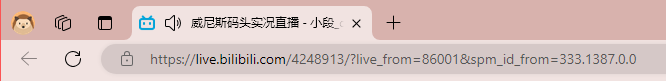
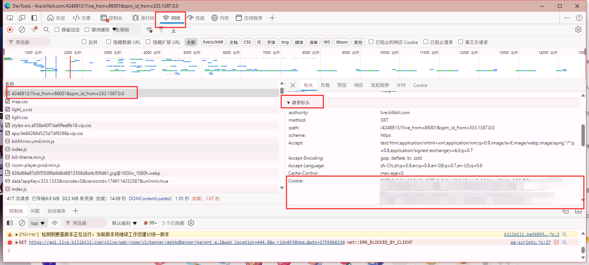
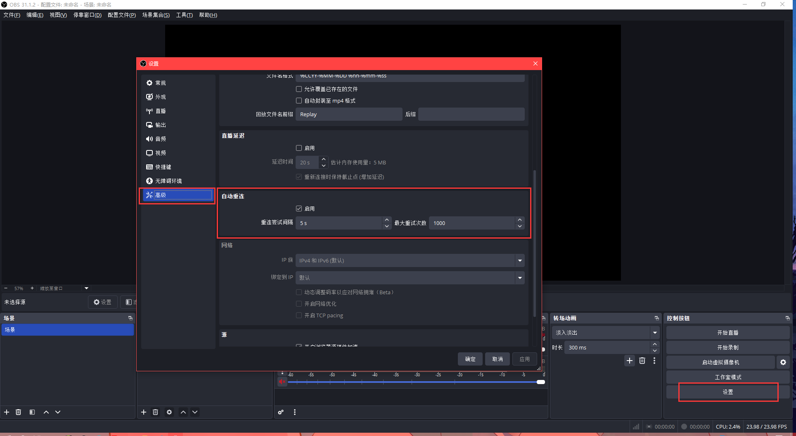

此程序用以检测指定b站直播间的状态，并在直播推流地址关闭时自动开启直播推流地址~建议搭配能断线重连的第三方直播工具使用（例如obs）

***注意:使用此程序时请声明来源!理论上使用此程序有小概率被封禁账号或直播的风险,使用此程序时默认你已知该风险,且本人不对使用此程序后所造成的任何结果负责!若担心风险或不认同此条款,请勿使用!***

该程序参考了以下项目

1. https://github.com/GamerNoTitle/BiliLive-Utility
2. https://github.com/Lee-7723/start-bilibili-live-obs-script

#### 使用教程：

##### 1，依赖库安装

若运行封装好的.exe文件请忽略此步骤

该程序需要在python3.8及以上的环境运行，且依赖 requests 库运行，请自行安装python环境，并打开命令行运行命令安装 requests 库

```
pip install requests
```

##### 2，下载程序

若运行.exe文件请[下载压缩包](https://github.com/duanyph/bilibili_ZhiBoZhuangTaiJianKong/releases/download/v1.0/bilibili_ZhiBoZhuangTaiJianKong_win_x86_x64_v1.0.zip)并解压

若运行.py程序请[下载代码包](https://github.com/duanyph/bilibili_ZhiBoZhuangTaiJianKong/archive/refs/tags/v1.0.zip)并解压，也可以自行安装git环境，并在命令行运行下载命令

```
git clone https://github.com/duanyph/bilibili_ZhiBoZhuangTaiJianKong.git
```

##### 3，修改配置 config.json 文件

打开项目文件夹，使用文本编辑器打开目录下的 config.json 文件，其字段如下:

```
{
    "room_id": "",
    "area_id": "",
    "cookie": "",
    "check_interval": 30,
    "retry_interval": 10,
    "max_retries": 10
    }
```

**字段说明：**

* room id: 你的直播间房间号
* area id: 直播分区ID，详见链接 [https://api.live.bilibili.com/room/v1/Area/getList?show_pinyin=1](https://api.live.bilibili.com/room/v1/Area/getList?show_pinyin=1)，其中"id"字段为直播间分区id，"name"字段为直播分区名
* cookie: 网页cookie，浏览器访问B站直播间页面（若未登录则登录一下），F12打开开发者工具（注意：开发者工具页面依浏览器品牌版本等原因有差异，这里以Microsoft Edge浏览器作为演示），切换到 网络 栏，选择与直播间地址栏链接相同的请求（若没有则在开启开发者工具的情况下刷新一下页面），切换至 标头 页，下拉找到 请求标头 项，找到其中的cookie字段复制粘贴到配置文件的cookie字段，确认一下cookie中包含SESSDATA和bili_jct，以如图所示

  

* check_interval: 检测直播间直播状态的时间间隔，单位为秒，默认为30秒
* retry_interval: 开启直播失败情况下重试的时间间隔,单位为秒，默认为10秒
* max_retries: 最大重试次数，默认10次。此值不易设置过大，否则一直尝试开启但并未实际直播推流的情况下可能会增加短期内直播封禁的风险

这里的配置文件使用的是json规范，前三项字段为文本类型，编辑的时候注意字段外侧保留一层英文双引号，后三项为数值类型，填写数字即可

##### 4，运行

解压并打开项目目录，运行.exe文件即可

若运行.py程序请在项目目录里打开命令行运行

```
python b站直播状态监控.py
```

程序运行时会在目录下生成日志文件，可以打开此文件了解程序运行时的历史状态

#### obs重连设置

额外讲一下直播软件obs的断线重连设置

此程序仅仅作为自动开启直播推流的辅助工具，并不具备直播功能，所以需要搭配第三方直播工具使用

此程序的工作流程是，当检测到指定直播间直播未开启，则尝试开启推流地址，若开启尝试多次后任未成功，则关闭程序，若成功则继续监控

当使用第三方直播工具直播过程中断开，该程序会继续打开推流地址，第三方直播工具则依赖自身的断线重连机制，继续连接推流地址进行推流直播

这里以第三方直播工具obs为例，配置重试设置

点开obs 设置，切换到 高级 选项卡，下拉找到 自动重连 项，勾选 启用，然后设置间隔时间和重试次数。通常情况下，obs自动重连是默认启用的，也可以根据自己需要进行修改设置


